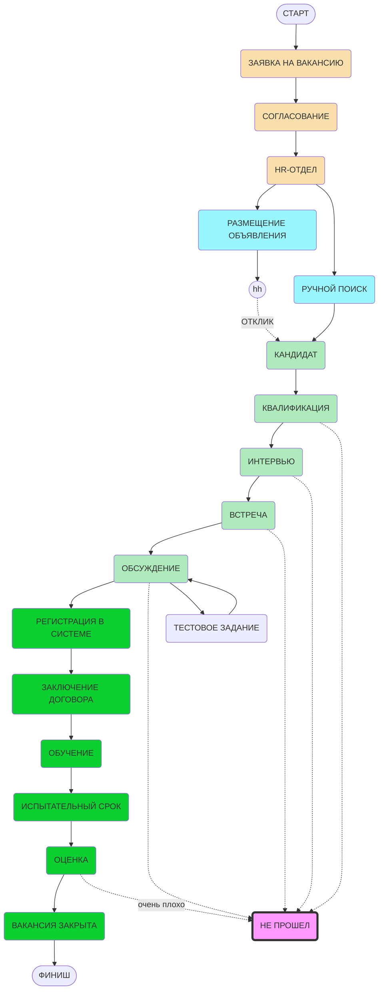

**[[заказчик]]**
- [[СТАРТ|инициация заявки]]
**[[HR]]**
- [[СОГЛАСОВАНИЕ|согласование]]
- [[ИНТЕРВЬЮ|организация интервью]] в почте
- [[ВСТРЕЧА|назначение встречи]]
**[[HR]]+[[заказчик]]**
- [[ИНТЕРВЬЮ]] - [[КАНДИДАТ]] и [[заказчик]]
- [[ОБСУЖДЕНИЕ|обсуждение кандидата]]: 
- [[ЗАКЛЮЧЕНИЕ ДОГОВОРА|заключение договора]]
**[[заказчик]]**
- [[ИСПЫТАТЕЛЬНЫЙ СРОК|испытательный срок]]

____

